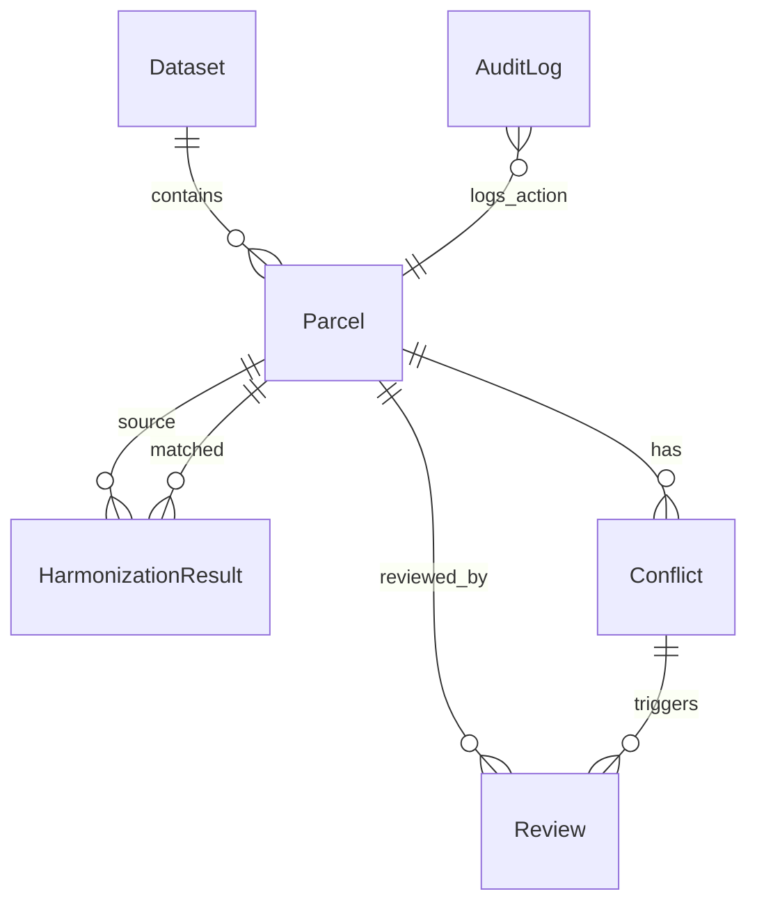

# BhuSync AI — Data Model Specification

---

## 1. Entity-Relationship Overview



---

## 2. Core Entities & Schema Definitions

### 2.1 Dataset (`datasets`)
Represents an ingested spatial or tabular data file (Cadastral GeoJSON, Municipal Shapefile, Revenue CSV, Drone Footprints, GNSS Survey).

| Column | Type | Constraints | Description |
|---|---|---|---|
| `id` | `VARCHAR(36)` | PRIMARY KEY | Unique UUID identifier |
| `name` | `VARCHAR(255)` | NOT NULL | Human-readable dataset title |
| `dataset_type` | `VARCHAR(50)` | NOT NULL | Enum: `CADASTRAL`, `MUNICIPAL`, `REVENUE`, `DRONE_FOOTPRINT`, `GNSS_SURVEY` |
| `source_agency` | `VARCHAR(100)` | NOT NULL | e.g., "Survey & Settlement", "Municipal Corp", "Survey of India" |
| `file_format` | `VARCHAR(20)` | NOT NULL | `GeoJSON`, `CSV`, `Shapefile` |
| `crs` | `VARCHAR(50)` | NOT NULL | Detected or assigned CRS, e.g., `EPSG:4326`, `EPSG:32643` |
| `feature_count` | `INTEGER` | DEFAULT 0 | Total number of features/records |
| `status` | `VARCHAR(30)` | NOT NULL | `UPLOADED`, `NORMALIZED`, `HARMONIZED`, `FAILED` |
| `file_path` | `VARCHAR(500)` | NULLABLE | Relative path to local stored file |
| `created_at` | `TIMESTAMP WITH TIME ZONE` | DEFAULT NOW() | Timestamp of ingestion |

---

### 2.2 Parcel (`parcels`)
Represents a land parcel or property polygon ingested from any source dataset, normalized into canonical schema and coordinate system (EPSG:4326).

| Column | Type | Constraints | Description |
|---|---|---|---|
| `id` | `VARCHAR(36)` | PRIMARY KEY | Unique UUID identifier |
| `dataset_id` | `VARCHAR(36)` | FOREIGN KEY | Reference to `datasets.id` |
| `parcel_id` | `VARCHAR(100)` | NOT NULL, INDEX | Primary identifier from source (e.g., "P-101", "ASSESS-882") |
| `survey_number`| `VARCHAR(100)` | NULLABLE, INDEX | Revenue survey / khasra / gut number |
| `geometry` | `GEOMETRY(Polygon, 4326)` | NOT NULL | Spatial polygon in WGS84 coordinates |
| `area` | `DOUBLE PRECISION`| NOT NULL | Area in square meters ($m^2$) calculated in metric projection |
| `owner_name` | `VARCHAR(255)` | NULLABLE | Registered owner / property taxpayer name |
| `land_use` | `VARCHAR(100)` | DEFAULT 'RESIDENTIAL' | `RESIDENTIAL`, `COMMERCIAL`, `AGRICULTURAL`, `GOVERNMENT`, `UTILITY` |
| `ward` | `VARCHAR(50)` | NULLABLE | Municipal ward number or administrative subdivision |
| `municipality` | `VARCHAR(100)` | NULLABLE | Urban local body name (e.g., "Bengaluru Urban", "Surat Municipal") |
| `attributes` | `JSONB` | DEFAULT '{}' | Raw key-value attributes preserved from original source |
| `created_at` | `TIMESTAMP WITH TIME ZONE` | DEFAULT NOW() | Creation timestamp |

---

### 2.3 HarmonizationResult (`harmonization_results`)
Stores the matching computation, sub-component similarity scores, explainable reasoning, and overall confidence between a source parcel (e.g., Cadastral) and candidate match (e.g., Municipal or Drone Footprint).

| Column | Type | Constraints | Description |
|---|---|---|---|
| `id` | `VARCHAR(36)` | PRIMARY KEY | Unique UUID identifier |
| `source_parcel_id`| `VARCHAR(36)` | FOREIGN KEY | ID of primary parcel (e.g., Cadastral) |
| `matched_parcel_id`| `VARCHAR(36)` | FOREIGN KEY, NULLABLE | ID of matched parcel (Municipal/Drone) |
| `geometry_score` | `DOUBLE PRECISION`| NOT NULL (0.0–1.0) | Spatial IoU & boundary alignment score (30% weight) |
| `area_score` | `DOUBLE PRECISION`| NOT NULL (0.0–1.0) | Area similarity score (20% weight) |
| `location_score` | `DOUBLE PRECISION`| NOT NULL (0.0–1.0) | Centroid proximity score (20% weight) |
| `attribute_score`| `DOUBLE PRECISION`| NOT NULL (0.0–1.0) | RapidFuzz owner & survey attribute similarity (15% weight)|
| `gnss_score` | `DOUBLE PRECISION`| NOT NULL (0.0–1.0) | Ground-truth GNSS proximity score (15% weight) |
| `overall_confidence`| `DOUBLE PRECISION`| NOT NULL (0.0–1.0) | Weighted composite score ($0.0 \dots 1.0$) |
| `status` | `VARCHAR(30)` | NOT NULL | `HIGH_CONFIDENCE` ($\ge 0.90$), `NEEDS_REVIEW` ($0.70-0.89$), `CONFLICT` ($< 0.70$) |
| `explanation` | `TEXT` | NOT NULL | Natural language explanation derived from computed values |
| `unified_geometry`| `GEOMETRY(Polygon, 4326)` | NULLABLE | Harmonized consensus geometry |
| `created_at` | `TIMESTAMP WITH TIME ZONE` | DEFAULT NOW() | Creation timestamp |

---

### 2.4 Conflict (`conflicts`)
Records anomalies, spatial shifts, area discrepancies, ownership mismatches, and topology violations detected during harmonization.

| Column | Type | Constraints | Description |
|---|---|---|---|
| `id` | `VARCHAR(36)` | PRIMARY KEY | Unique UUID identifier |
| `parcel_id` | `VARCHAR(36)` | FOREIGN KEY | Associated primary parcel ID |
| `conflict_type` | `VARCHAR(50)` | NOT NULL | `AREA_MISMATCH`, `OWNER_MISMATCH`, `GEOMETRY_SHIFT`, `TOPOLOGY_VIOLATION`, `MISSING_ATTRIBUTES` |
| `severity` | `VARCHAR(20)` | NOT NULL | `LOW`, `MEDIUM`, `HIGH`, `CRITICAL` |
| `description` | `TEXT` | NOT NULL | Plain-English summary of the dispute or anomaly |
| `source_a` | `VARCHAR(100)` | NOT NULL | First dataset/source name (e.g., "Cadastral Survey 2018") |
| `source_b` | `VARCHAR(100)` | NOT NULL | Second dataset/source name (e.g., "Municipal Tax Register 2023") |
| `difference` | `TEXT` | NOT NULL | Quantitative delta (e.g., "Delta: 85.4 m² (+11.2%)", "Levenshtein: 64%") |
| `status` | `VARCHAR(30)` | NOT NULL | `OPEN`, `RESOLVED`, `REJECTED`, `FLAGGED_RESURVEY` |
| `resolution` | `TEXT` | NULLABLE | Officer's resolution notes or chosen canonical source |
| `created_at` | `TIMESTAMP WITH TIME ZONE` | DEFAULT NOW() | Creation timestamp |

---

### 2.5 Review (`reviews`)
Records human-in-the-loop decisions made by authorized land-record officers.

| Column | Type | Constraints | Description |
|---|---|---|---|
| `id` | `VARCHAR(36)` | PRIMARY KEY | Unique UUID identifier |
| `parcel_id` | `VARCHAR(36)` | FOREIGN KEY | Associated parcel ID |
| `conflict_id` | `VARCHAR(36)` | FOREIGN KEY, NULLABLE | Optional linked conflict ID |
| `reviewer` | `VARCHAR(100)` | NOT NULL | Officer username / badge ID (e.g., "officer_sharma") |
| `decision` | `VARCHAR(50)` | NOT NULL | `APPROVE_RECOMMENDATION`, `REJECT_MATCH`, `OVERRIDE_GEOMETRY`, `FLAG_FIELD_RESURVEY` |
| `comment` | `TEXT` | NOT NULL | Legal justification / administrative remarks |
| `created_at` | `TIMESTAMP WITH TIME ZONE` | DEFAULT NOW() | Action timestamp |

---

### 2.6 AuditLog (`audit_logs`)
Tamper-evident system log tracking all lifecycle events, model inferences, and manual interventions.

| Column | Type | Constraints | Description |
|---|---|---|---|
| `id` | `VARCHAR(36)` | PRIMARY KEY | Unique UUID identifier |
| `action` | `VARCHAR(50)` | NOT NULL | `DATASET_UPLOADED`, `HARMONIZATION_EXECUTED`, `CONFLICT_RESOLVED`, `DECISION_APPROVED` |
| `entity` | `VARCHAR(50)` | NOT NULL | `DATASET`, `PARCEL`, `CONFLICT`, `REVIEW` |
| `entity_id` | `VARCHAR(36)` | NOT NULL | Identifier of the affected entity |
| `user` | `VARCHAR(100)` | NOT NULL | Actor name ("SYSTEM" or officer name) |
| `details` | `JSONB` | DEFAULT '{}' | Contextual metadata, before/after values, and parameters |
| `timestamp` | `TIMESTAMP WITH TIME ZONE` | DEFAULT NOW() | Event timestamp |

---

## 3. Pydantic Domain Schemas

```python
from pydantic import BaseModel, Field
from typing import Optional, Dict, Any, List
from datetime import datetime
from enum import Enum

class DatasetType(str, Enum):
    CADASTRAL = "CADASTRAL"
    MUNICIPAL = "MUNICIPAL"
    REVENUE = "REVENUE"
    DRONE_FOOTPRINT = "DRONE_FOOTPRINT"
    GNSS_SURVEY = "GNSS_SURVEY"

class ConflictType(str, Enum):
    AREA_MISMATCH = "AREA_MISMATCH"
    OWNER_MISMATCH = "OWNER_MISMATCH"
    GEOMETRY_SHIFT = "GEOMETRY_SHIFT"
    TOPOLOGY_VIOLATION = "TOPOLOGY_VIOLATION"
    MISSING_ATTRIBUTES = "MISSING_ATTRIBUTES"

class ConflictSeverity(str, Enum):
    LOW = "LOW"
    MEDIUM = "MEDIUM"
    HIGH = "HIGH"
    CRITICAL = "CRITICAL"

class HarmonizationStatus(str, Enum):
    HIGH_CONFIDENCE = "HIGH_CONFIDENCE"
    NEEDS_REVIEW = "NEEDS_REVIEW"
    CONFLICT = "CONFLICT"

class ReviewDecision(str, Enum):
    APPROVE_RECOMMENDATION = "APPROVE_RECOMMENDATION"
    REJECT_MATCH = "REJECT_MATCH"
    OVERRIDE_GEOMETRY = "OVERRIDE_GEOMETRY"
    FLAG_FIELD_RESURVEY = "FLAG_FIELD_RESURVEY"
```
